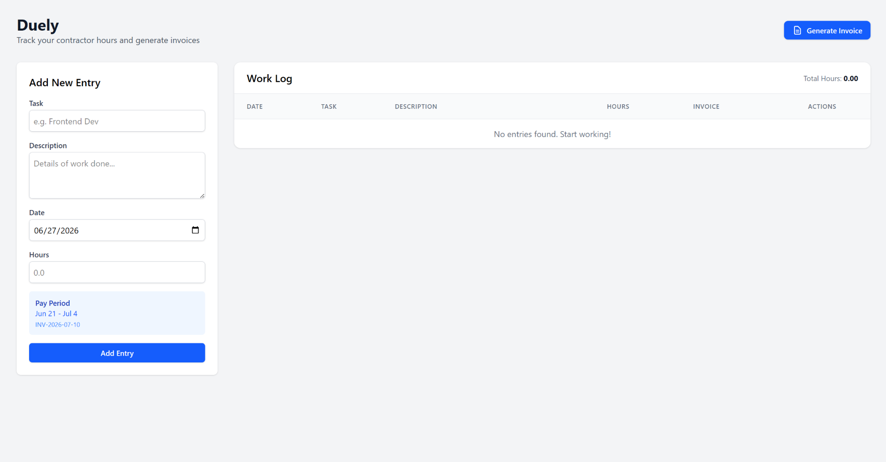
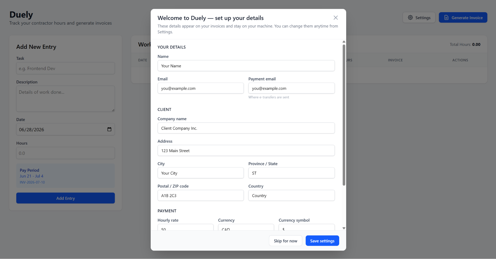

# Duely

**Local time tracking + automatic invoicing for contractors.** Log your hours
and generate professional PDF invoices automatically, based on your bi-weekly
pay periods.

Everything runs on your own machine and your data stays in local files. No
account, no cloud, no one else can see your hours.



## Features

- **Track Work Hours**: Log tasks with date, description, and hours worked
- **Automatic Invoice Numbers**: Invoices are assigned automatically based on pay periods (format: `INV-YYYY-MM-DD`, where the date is the payment date)
- **PDF Invoice Generation**: Generate professional, multi-page PDF invoices with a live preview
- **Inline Editing**: Click any cell to edit entries directly in the table
- **Auto-Save**: Changes are saved automatically when you click outside the row or press Enter
- **Pay Period Preview**: See which pay period a date falls into before adding an entry
- **Your details, configured once**: Contractor info, client details, rate, currency, and pay schedule live in a local config file — no source code editing required
- **Local storage**: Time entries are saved to a local `Tracker.xlsx` file you fully control

## Pay Period System

- Pay periods are **2-week blocks** running Sunday to Saturday
- Payment occurs on the **Friday** following the 2nd Monday after the period ends
- Example: Work done Nov 23 – Dec 6 → Invoice `INV-2025-12-12` (paid Dec 12)

The anchor date, period length, and payment offset are all configurable (see
[Configuration](#configuration)).

## Getting Started

### Prerequisites

- [Node.js](https://nodejs.org/) (v18 or higher)
- npm (comes with Node.js)

### Installation

1. Clone or download this project
2. Install dependencies:
   ```bash
   npm install
   ```

### Running the App

**Option 1 — One command (all platforms)**
```bash
npm run dev:full
```
This starts both the backend server and the frontend. Then open
[http://localhost:5173](http://localhost:5173) in your browser.

**Option 2 — Double-click launcher**
- **Windows**: double-click `start-duely.bat`
- **macOS / Linux**: run `./start-duely.sh` (you may need `chmod +x start-duely.sh` once)

Both launchers start the app and open your browser automatically.

**Option 3 — Run the pieces separately**
```bash
# Terminal 1 — backend API server (port 3001)
npm run server

# Terminal 2 — frontend (port 5173)
npm run dev
```

## Configuration

Duely is configured from an in-app **Settings** screen — no source code or JSON
editing required. On first launch, before any details are filled in, it opens
automatically; after that, open it anytime from the **Settings** button (gear
icon) in the header. Enter your details and click **Save settings**.



Your details are saved to a local `config.json` in the project root, created on
first run from the committed `config.example.json` template. `config.json` is
**git-ignored**, so your information stays private and is never committed.

Prefer to edit the file by hand? It has this shape:

```json
{
  "contractor": {
    "name": "Your Name",
    "email": "you@example.com",
    "paymentEmail": "you@example.com"
  },
  "client": {
    "name": "Client Company Inc.",
    "address": "123 Main Street",
    "city": "Your City",
    "province": "ST",
    "postalCode": "A1B 2C3",
    "country": "Country"
  },
  "payment": {
    "hourlyRate": 50,
    "currency": "CAD",
    "currencySymbol": "$"
  },
  "payPeriod": {
    "referenceStartDate": "2025-01-05",
    "periodLengthDays": 14,
    "paymentDaysAfterPeriodEnd": 6
  }
}
```

- **contractor**: your name, contact email, and the email payments are sent to
- **client**: the company you invoice, with full address
- **payment**: hourly rate, currency code, and symbol
- **payPeriod**: `referenceStartDate` must be a **Sunday** that anchors your
  pay-period calendar; `periodLengthDays` is the period length (14 = bi-weekly);
  `paymentDaysAfterPeriodEnd` is how many days after the period ends you get paid

If you edit `config.json` by hand, reload the app to pick up the changes. (Saving
from the Settings screen applies immediately — no reload needed.)

## Usage

### Adding Entries
1. Fill in the Task, Description, Date, and Hours fields
2. The Pay Period preview shows which invoice the entry will be assigned to
3. Click "Add Entry" to save

### Editing Entries
- Click any cell in the table to edit that row
- Press **Enter** to save, or click anywhere outside the row
- Press **Escape** to cancel without saving

### Deleting Entries
- Hover over a row and click the trash icon to delete

### Generating Invoices
1. Click the **Generate Invoice** button in the header
2. Select a pay period from the dropdown (most recent first)
3. Preview the invoice with all line items and totals
4. Click **Download PDF** to save the invoice

## Your Data & Privacy

This app is fully local:

- **Time entries** are stored in `Tracker.xlsx` in the project root
- **Your details** are stored in `config.json` in the project root
- Both files are **git-ignored** and never leave your machine
- The server listens only on `localhost` and is meant to be run on your own computer

To back up or move your data, just copy `Tracker.xlsx` and `config.json`.

## Tech Stack

- **Frontend**: React 19, Vite, Tailwind CSS
- **Backend**: Express.js
- **Storage**: Excel file (xlsx) + JSON config
- **PDF Generation**: jsPDF with jspdf-autotable

## Project Structure

```
duely/
├── src/
│   ├── App.jsx                 # Main React component
│   ├── main.jsx                # React entry point (wraps app in ConfigProvider)
│   ├── index.css               # Tailwind imports
│   ├── components/
│   │   └── InvoiceModal.jsx    # Invoice preview & PDF modal
│   ├── config/
│   │   ├── ConfigContext.jsx   # Loads runtime config from the server
│   │   └── configHelpers.js    # Currency / address formatting helpers
│   └── utils/
│       ├── invoiceUtils.js     # Pay period & invoice calculations
│       └── pdfGenerator.js     # PDF invoice generation
├── server/
│   └── index.js                # Express backend API
├── config.example.json         # Config template (committed)
├── config.json                 # Your local config (git-ignored, auto-created)
├── Tracker.xlsx                # Your time entries (git-ignored, auto-created)
├── start-duely.bat             # Windows launcher
├── start-duely.sh              # macOS / Linux launcher
└── package.json
```

## API Endpoints

| Method | Endpoint | Description |
|--------|----------|-------------|
| GET | `/api/entries` | Get all time entries |
| POST | `/api/entries` | Add a new entry |
| PUT | `/api/entries/:index` | Update an entry |
| DELETE | `/api/entries/:index` | Delete an entry |
| GET | `/api/config` | Get the runtime config |
| PUT | `/api/config` | Replace the runtime config |

## Feedback & Contributing

Found a bug or have an idea to make Duely better? Please **[open an issue](../../issues)** — it's the best way to reach me, and all you need is a free GitHub account.

This is a personal project, so I may not merge pull requests, but bug reports, questions, and suggestions are genuinely welcome.

## License

Released under the [MIT License](LICENSE).
